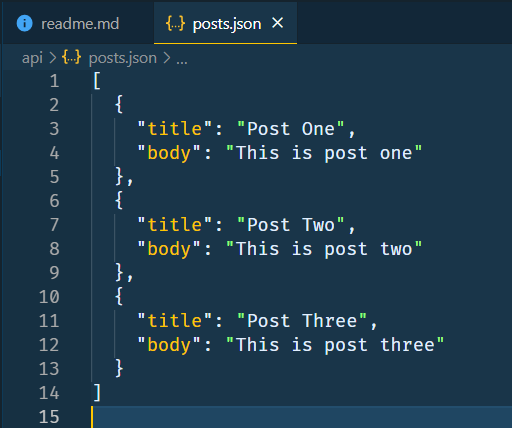

# My Fetch API Project

This is a project I made for experimenting the fetch API.

[You can see my github for more details](github.com/pradyu-hebbar)

## About the _Fetch Api_

### To Use The Fetch Api:-

- Use the `fetch()` method and `fetch()` returns a `Promise()`
- To do something after the promise has been resolved, we use the `then()` method. Example:-

```JavaScript
  fetch("something")
  .then(()=>{
    return 123
  });
```

- To detect an error, We use the `catch` method. Example:-

```JavaScript
  fetch("something")
  .then(()=>{
    return 123
  })
  .catch(()=>{
    throw new Error("Something went wrong!")
  })

```

- You can add as many `then()` and `catch()` methods as you like.

## Fetch local text using `fetch()`

### To extract a .txt file using `fetch()`:-

- Create a text file a add text into it.
- When using `fetch()` :-

```JavaScript
fetch(data.txt)
// Fetch Returns a promise
.then((res)=>{
  // res means the response after fetching
  return res.text()
  //res.text() returns the response value as text
})
.then((data)=>{
  // data refers to the text returned by res.text()
  // You can use the data to do anything.
  console.log(data);
});
```

## Fetch local JSON data

### To fetch local JSON data:-

- Create a json file and put some data.Example:-

  

- While using `fetch()`:-

```Javascript
fetch("./api/posts.json")
    .then((res) => {
      // Instead of res.text(), we use the res.json() to return json
      return res.json();
    })
    .then((data) => {
      // Just Like text, you can do whatever you want with the json
      console.log(data)
    });
```

## Fetch data from external API

### To fetch data from a rest API:-

- let's fetch some data from the [Github Api](https://api.github.com/users)
- While using fetch:-

```JavaScript
fetch("https://api.github.com/users")
.then((res)=>{
  // The github API consists of the data of the first 100 users.It is stored as json.
  return res.json();
})
.then((data)=>{
console.log(data);
});
```

**Bye guys, See you in the next project!**

@@@@@@@@@@@@@@@@@@@@@@@@@@@@@@@@@@@@@@@@@@@
